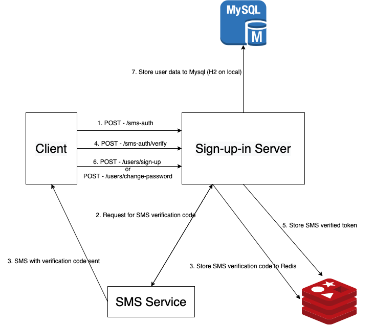

# Sign-up-in
---
## Steps to run on local
1. Build the Java application 
```
./gradlew clean build
```

2. Build the Docker image
```
docker build -t sign-up-in:0.0.1 .
```

3. Run docker-compose
```
// to run as daemon
docker-compose up -d

// else
docker-compose up
```

4. Test to see if the server is running well on local (127.0.0.1:10001)

***FYI***
***Doesn't support Korean due to data verification logics.***

### Extras
#### How to use Redis terminal on local
```
docker exec -it redis redis-cli
```

#### How to get access to database on local
You can go to http://127.0.0.1:10001/h2-console and login with below informations
```
Setting Name: Generic H2 (Embedded)
JDBC URL: jdbc:h2:file:./data/h2/dev
User Name: user
Password: user
```

#### How to reset the database on local
When running on local, the service will use H2 and store the data at "./data/h2" path.
Delete the data in the directory and you can clean up the database.


## Architecture (Flow)



## Features
### 기능 요구사항
- 회원가입 기능: O
- 전화번호 인증 후 회원가입 + 비밀번호 재설정 기능: O
- 로그인 기능: O (이메일과 핸드폰 번호를 이용하여 로그인 가능)
- 내 정보 보기 기능: O
- 비밀번호 재설정 기능: O

### 추가 구현 기능 및 소개할 점
- 비밀번호 복호화
- 데이터 검사
- Stateless한 서버로 scale out이 가능한 구조 (Redis, JWT Token 등 활용)
- 컨테이너화


## Used skills
- Java Spring Boot
- Redis
- Mysql (H2 for local)
- Docker


## APIs

### POST - /sms-auth
Request for SMS authentication


#### Header
| KEY  | VALUE | REQUIRED |
| ---- | ----- | -------- |
|Content-Type   |application/json       |O        |


#### Body Parameters
| KEY  | VALUE | REQUIRED |
| ---- | ----- | -------- |
|name      |string      |O        |
|phoneNumber      |string      |O          |


#### Success Response
Code: 200 (success)
Content:
~~~
// if running on local
{{SMS VERFICATION CODE}}
~~~

---

### POST - /sms-auth/verify
Verify the SMS verificationCode


#### Header
| KEY  | VALUE | REQUIRED |
| ---- | ----- | -------- |
|Content-Type   |application/json       |O        |


#### Body Parameters
| KEY  | VALUE | REQUIRED |
| ---- | ----- | -------- |
|name      |string      |O        |
|phoneNumber      |string       |O          |
|verificationCode      |int       |O          |


#### Success Response
Code: 200 (success)
Content:
~~~
{
    "name": {NAME_STRING},
    "phoneNumber": {PHONE_NUMBER_STRING},
    "verifiedToken": {SMS_VERIFIED_TOKEN}
}
~~~

---

### POST - /users/sign-up
Request for sign-up


#### Header
| KEY  | VALUE | REQUIRED |
| ---- | ----- | -------- |
|Content-Type   |application/json       |O        |
|X-Sms-VerifiedToken   |{SMS_VERIFIED_TOKEN}       |O        |


#### Body Parameters
| KEY  | VALUE | REQUIRED |
| ---- | ----- | -------- |
|email      |string      |O        |
|nickname      |string       |O          |
|name      |string       |O          |
|phoneNumber      |string       |O          |
|password      |string       |O          |


#### Success Response
Code: 200 (success)
Content:
~~~
{
    "email": {EMAIL_STRING},
    "nickname": {NICK_NAME_STRING},
    "name": {NAME_STRING},
    "phoneNumber": {PHONE_NUMBER_STRING}
}
~~~

---

### POST - /users/change-password
Request change password


#### Header
| KEY  | VALUE | REQUIRED |
| ---- | ----- | -------- |
|Content-Type   |application/json       |O        |
|X-Sms-VerifiedToken   |{SMS_VERIFIED_TOKEN}       |O        |


#### Body Parameters
| KEY  | VALUE | REQUIRED |
| ---- | ----- | -------- |
|name      |string      |O        |
|phoneNumber      |string       |O          |
|password      |string       |O          |


#### Success Response
Code: 200 (success)
Content:
~~~

~~~

---

### POST - /users/sign-in
Request for sign-in


#### Header
| KEY  | VALUE | REQUIRED |
| ---- | ----- | -------- |
|Content-Type   |application/json       |O        |


#### Body Parameters
| KEY  | VALUE | REQUIRED |
| ---- | ----- | -------- |
|idField      |string("email" or "phone_number"      |O        |
|idValue      |string       |O          |
|password      |string       |O          |


#### Success Response
Code: 200 (success)
Content:
~~~
{
    "email": {EMAIL_STRING},
    "nickname": {NICK_NAME_STRING},
    "name": {NAME_STRING},
    "phoneNumber": {PHONE_NUMBER_STRING}
    "jwtToken": {JWT_TOKEN}
}
~~~

---

### GET - /users/my-info
Request for my info


#### Header
| KEY  | VALUE | REQUIRED |
| ---- | ----- | -------- |
|Content-Type   |application/json       |O        |
|Authorization   |Bearer {JWT_TOKEN}       |O        |


#### Body Parameters
| KEY  | VALUE | REQUIRED |
| ---- | ----- | -------- |
|      |       |          |


#### Success Response
Code: 200 (success)
Content:
~~~
{
    "email": {EMAIL_STRING},
    "nickname": {NICK_NAME_STRING},
    "name": {NAME_STRING},
    "phoneNumber": {PHONE_NUMBER_STRING}
}
~~~
